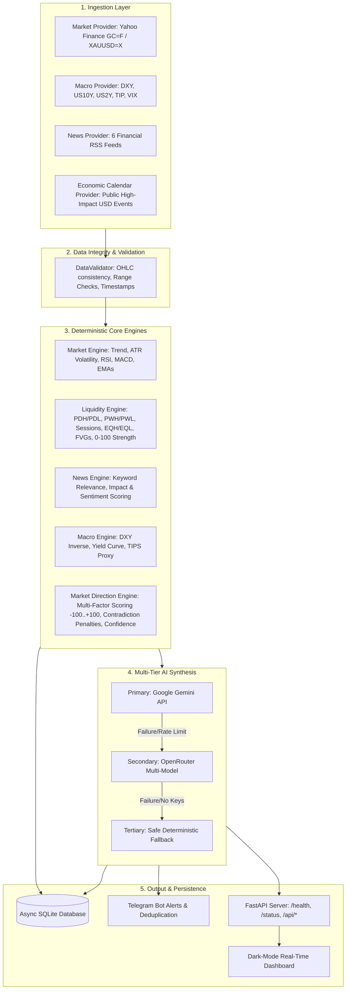

# Architecture Documentation

## System Topology & Data Flow

---

## Component Breakdown

### 1. Data Ingestion Layer (`app/data/`)
- **Abstract Provider Base**: All providers implement `BaseDataProvider` with automatic latency tracking, error metrics, and health record persistence.
- **Circuit Breakers & Retries**: External network operations have strict timeouts (10-15s), exponential retries, and fallback symbols (e.g. `GC=F` $\rightarrow$ `XAUUSD=X` $\rightarrow$ `GLD`).

### 2. Validation Layer (`app/data/validation.py`)
- Enforces strict constraints:
  - High $\ge \max(\text{Open}, \text{Close}, \text{Low})$
  - Low $\le \min(\text{Open}, \text{Close}, \text{High})$
  - Rejection of negative, zero, or unrealistic price jumps.

### 3. Quantitative Engines (`app/analysis/`)
- **Session Calculator**: Extracts Asian (00:00-08:00 UTC), London (07:00-15:30 UTC), and New York (12:00-20:00 UTC) high/low boundaries.
- **Liquidity Engine**: Computes exact cluster zones, equal highs/lows, and Fair Value Gaps with deterministic strength scores (0-100) based on touch counts, timeframe weighting, recency, and price distance.
- **Direction Engine**: Combines Macro (25%), USD (15%), Yields (15%), News (15%), Technicals (20%), and Liquidity (10%). Applies conflict penalties when pillars contradict each other.

### 4. AI Synthesis Layer (`app/ai/`)
- Pydantic schema validation ensures the AI only returns structured JSON conforming to `AISynthesisOutput`.
- If Gemini or OpenRouter fail or keys are absent, the system immediately switches to `DeterministicFallbackProvider`, maintaining 100% operational uptime.

### 5. Storage Layer (`app/storage/`)
- SQLite via `SQLAlchemy` & `aiosqlite`.
- Persistent tables: `market_snapshots`, `liquidity_zones`, `news_events`, `economic_events`, `analysis_runs`, `alerts`, `provider_health`.
